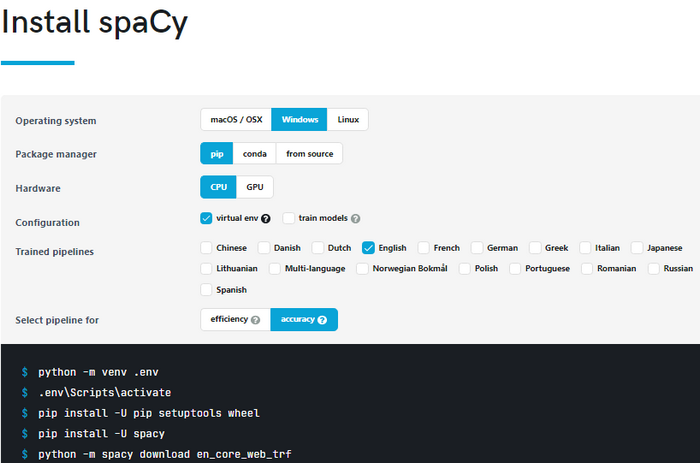

# deidentify
Deidentify people's names along with pronoun substitution

**Note: This is currently a work in progress!**

## Synopsis

This program is used to substitute a person's given name and/or surname along with any gender specific pronouns.

## Example

```
Input:
I think John Smith likes programming. You can tell he enjoys using Python.

Output:
I think PERSON likes programming. You can tell HE/SHE enjoys using Python.
```

## Configuration

* This program relies on [Spacy](https://spacy.io/) for [Named-entitiy recognition](https://en.wikipedia.org/wiki/Named-entity_recognition) and [pronoun](https://en.wikipedia.org/wiki/Pronoun) substitution.
* For best results, you can set up a [Python Virtual Environment](https://docs.python.org/3/library/venv.html) and install `Spacy` with these settings:
* 
* `Spacy` can be installed with [other Spacy configuration options](https://spacy.io/usage).
* Once you have activated your [Python Virtual Environment](https://docs.python.org/3/library/venv.html), you can then install `Spacy`:

```shell
python -m pip install --upgrade pip
pip install setuptools wheel
pip install spacy
python -m spacy en_core_web_trf
```

## Example

```shell
-- Windows 

cd deidentify
scripts\activate
python deidentify.py input.txt > output.txt
diff input.txt output.txt

--Linux

cd deidentify
source bin/activate
python3 deidentify.py input.txt > output.txt
diff input.txt output.txt
```

## TO DO
* provide command line arguments for:
* * `PROPER_NAME_REPLACEMENT`: replace a detected name with this given string
* * `RESULTS_FILE`: a temporary file containing json entries for detected entities, pronouns, and possible misses
